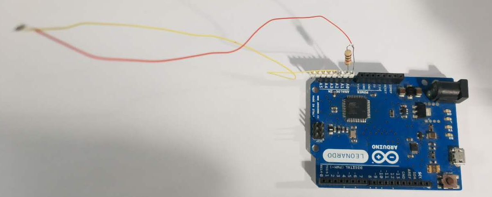

# An LED You Can Blow Out Like A Candle

The idea and Arduino code are from https://www.instructables.com/id/An-LED-You-Can-Blow-Out-Like-a-Candle/
which just uses and Arduino Uno, a 0402 LED and a resistor. It works well.

The Arduino Uno or Leonardo only has a 10 bits ADC. The ADC resolution is a little bit low. while an Arch Pro (mbed enabled LPC1768) with a 12 bits ADC was just in my hand, so I wrote a mbed version which make it easier to analyze.

There are also two python scripts to plot the voltage of the LED. The scripts require `pyserial`, `pyside`, `numpy` and `pyqtgraph`.

When we blow the LED, most likely we will heat the LED with hot air, which will decrease the voltage drop of the LED. I use a 0603 red LED, its voltage drop is about 1.8V.

# Further Idea
We can use this idea to re-create [Jie Qi's Pu Gong Ying Tu (Dandelion Painting)](http://technolojie.com/pu-gong-ying-tu-dandelion-painting/)

>Pu Gong Ying Tu is an interactive painting of a dandelion field. When you blow on the white puffs, the seeds disperse and generate new flowers. These flowers begin as yellow dandelions, but after a few moments bloom into responsive white seed puffs. 
from [Jie Qi](http://technolojie.com/pu-gong-ying-tu-dandelion-painting/)

In the original implementation, microphones are used to detect the blowing action. We can just use LEDs instead.

